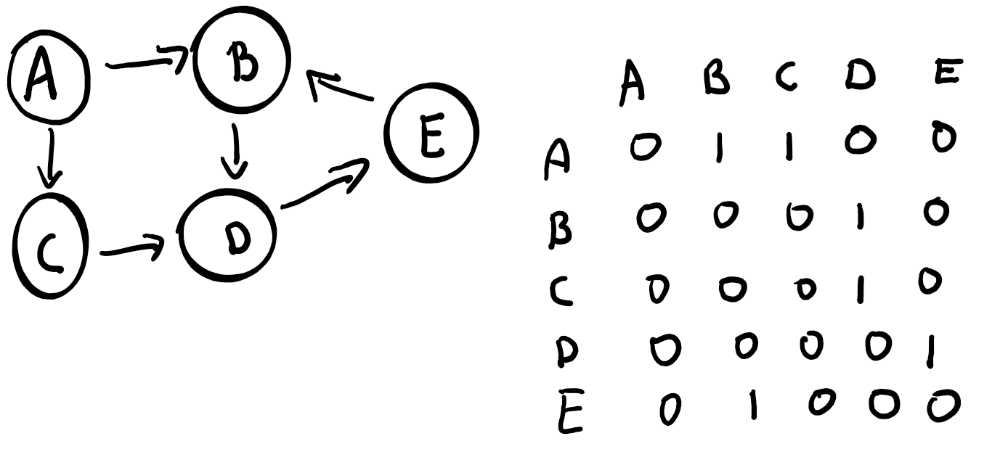

Create a communication topology from this adjacency matrix:

Then implement controlled flooding algorithm with sequence number.
The actor A will start the algorithm with sequence number 0 (it means: the first "flooding")
If an actor receives a message with a sequence number, it stores it (for the first "flooding" it will always be 0).
If the sequence number is already stored, it drops the message.

You can try to flood a second and a third time: A will therefore start with sequence number 1 and 2.
